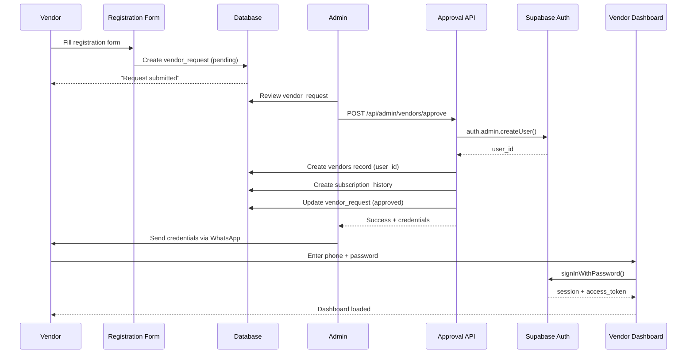

# Vendor Authentication Quick Fix Guide

## CRITICAL ISSUE
Vendors cannot login because Supabase Auth users are not being created during approval.

---

## IMMEDIATE FIX (Deploy in 30 minutes)

### Step 1: Run Migration Script for Existing Vendors
This will create auth users for all approved vendors who currently have `user_id = NULL`

```bash
cd /home/taleb/rimmarsa/marketplace
npx tsx scripts/fix-vendor-auth.ts
```

**Expected Output:**
```
🔧 VENDOR AUTHENTICATION FIX SCRIPT
====================================

📋 Fetching vendors without auth accounts...
⚠️  Found 5 vendors WITHOUT auth accounts

🔄 Processing: متجر التوحيد
   Phone: +22223456677
   Email: 23456677@vendor.rimmarsa.com
   🔐 Creating auth user...
   ✅ Auth user created: abc-123-def
   🔗 Linking to vendor record...
   ✅ Linked successfully

📊 SUMMARY
==========
✅ Successfully created: 5
ℹ️  Already existed: 0
❌ Errors: 0

💾 Credentials saved to: /credentials-output/vendor-credentials-2025-10-22.txt
```

**What it does:**
1. ✅ Finds all approved vendors with `user_id = NULL`
2. ✅ Creates Supabase Auth users via admin API
3. ✅ Links auth users to vendor records
4. ✅ Generates secure temporary passwords
5. ✅ Saves credentials to file for distribution

**After running:**
- Check the credentials file in `/credentials-output/`
- Send credentials to vendors via WhatsApp
- Verify vendors can login

---

### Step 2: Update Admin Approval Process (For Future Vendors)

The new API route has been created at:
```
/marketplace/src/app/api/admin/vendors/approve/route.ts
```

**Update the admin UI to use the new endpoint:**

Edit: `/marketplace/src/app/fassalapremierprojectbsk/vendor-requests/page.tsx`

Replace the `handleApprove` function (lines 124-152):

```typescript
const handleApprove = async (request: VendorRequest) => {
  if (!confirm(`Approve ${request.business_name}? This will create their login account.`)) {
    return
  }

  setProcessing(true)

  try {
    // Call NEW API route instead of database function
    const response = await fetch('/api/admin/vendors/approve', {
      method: 'POST',
      headers: {
        'Content-Type': 'application/json',
      },
      body: JSON.stringify({
        request_id: request.id,
      }),
    })

    const data = await response.json()

    if (!response.ok) {
      throw new Error(data.error || 'Failed to approve vendor')
    }

    // Show success with login instructions
    toast.success(`✅ Vendor approved successfully!

Login Instructions:
Phone: ${data.credentials.phone_digits}
URL: ${data.credentials.login_url}

Send password via WhatsApp/Signal`)

    fetchRequests()
    setShowDetailsModal(false)
  } catch (error: unknown) {
    console.error('Error approving vendor:', error)
    const errorMessage = error instanceof Error ? error.message : 'Failed to approve vendor'
    toast.error(errorMessage)
  } finally {
    setProcessing(false)
  }
}
```

---

### Step 3: Verify the Fix

Test with the existing vendor:

1. **Try Login**
   ```
   Phone: 23456677 (last 8 digits of +22223456677)
   Password: (from credentials file)
   ```

2. **Expected Result:**
   - ✅ Login succeeds
   - ✅ Redirected to vendor dashboard
   - ✅ Session created

3. **Check Database:**
   ```sql
   SELECT
     id,
     business_name,
     phone,
     user_id,
     is_approved
   FROM vendors
   WHERE phone = '+22223456677';
   ```

   **Expected:**
   - `user_id` is NOT NULL ✅
   - `is_approved` is TRUE ✅

---

## ROOT CAUSE EXPLAINED

### The Problem
```
┌─────────────────────────────────────────┐
│ BROKEN FLOW (What was happening)       │
├─────────────────────────────────────────┤
│                                         │
│  1. Admin approves vendor               │
│  2. Database function tries to          │
│     INSERT into auth.users              │
│  3. ❌ FAILS - auth user NOT created   │
│  4. Vendor record created with          │
│     user_id = NULL                      │
│  5. Vendor tries to login               │
│  6. ❌ FAILS - no auth user exists     │
│                                         │
└─────────────────────────────────────────┘
```

### Why Database Function Failed
The SQL function `approve_vendor_request()` tried to:
```sql
INSERT INTO auth.users (...) VALUES (...)
```

**This doesn't work because:**
1. Direct INSERT into `auth.users` doesn't trigger Supabase Auth infrastructure
2. Password hashing algorithm mismatch
3. Missing identity provider records
4. No session management setup

### The Solution
```
┌─────────────────────────────────────────┐
│ FIXED FLOW (What happens now)          │
├─────────────────────────────────────────┤
│                                         │
│  1. Admin approves vendor               │
│  2. Call /api/admin/vendors/approve     │
│  3. API uses service role to call:      │
│     supabaseAdmin.auth.admin.createUser │
│  4. ✅ Auth user created properly       │
│  5. Vendor record created with          │
│     user_id = <auth_user_id>            │
│  6. Vendor logs in                      │
│  7. ✅ SUCCESS - auth user exists       │
│  8. ✅ Dashboard loads                  │
│                                         │
└─────────────────────────────────────────┘
```

---

## DETAILED WORKFLOW

### New Vendor Registration Flow



### Login Flow

```
┌────────────────────────────────────────────────────────┐
│ VENDOR LOGIN PROCESS                                   │
├────────────────────────────────────────────────────────┤
│                                                        │
│  1. Vendor enters:                                     │
│     - Phone digits: 23456677                           │
│     - Password: MySecurePass123!                       │
│                                                        │
│  2. Frontend calls:                                    │
│     POST /api/vendor/login                             │
│     {                                                  │
│       phoneDigits: "23456677",                         │
│       password: "MySecurePass123!"                     │
│     }                                                  │
│                                                        │
│  3. API generates email:                               │
│     23456677@vendor.rimmarsa.com                       │
│                                                        │
│  4. API calls:                                         │
│     supabaseAdmin.auth.signInWithPassword({            │
│       email: "23456677@vendor.rimmarsa.com",           │
│       password: "MySecurePass123!"                     │
│     })                                                 │
│                                                        │
│  5. Supabase Auth:                                     │
│     - Searches auth.users WHERE email = ...            │
│     - Verifies password hash                           │
│     - ✅ Returns session + access_token                │
│                                                        │
│  6. API verifies vendor:                               │
│     - Fetches vendor WHERE user_id = <auth_user_id>    │
│     - Checks is_active = true                          │
│     - Checks is_approved = true                        │
│                                                        │
│  7. API returns:                                       │
│     - Sets HttpOnly cookies (access + refresh tokens)  │
│     - Returns vendor data (NO tokens in JSON)          │
│                                                        │
│  8. ✅ Vendor redirected to dashboard                  │
│                                                        │
└────────────────────────────────────────────────────────┘
```

---

## TROUBLESHOOTING

### Issue: Script fails with "user already exists"

**Cause:** Auth user exists but vendor.user_id is NULL

**Solution:**
```sql
-- Find orphaned auth users
SELECT u.id, u.email, u.created_at
FROM auth.users u
WHERE u.email LIKE '%@vendor.rimmarsa.com'
AND NOT EXISTS (
  SELECT 1 FROM vendors v WHERE v.user_id = u.id
);

-- Manual link (replace IDs)
UPDATE vendors
SET user_id = '<auth_user_id>'
WHERE phone = '+22223456677';
```

### Issue: Vendor can't login after fix

**Possible causes:**
1. Password incorrect → Check credentials file
2. Vendor not approved → Check `is_approved = true`
3. Vendor not active → Check `is_active = true`
4. Email mismatch → Verify email generation

**Debug query:**
```sql
SELECT
  v.id,
  v.business_name,
  v.phone,
  v.email,
  v.user_id,
  v.is_approved,
  v.is_active,
  u.email as auth_email,
  u.created_at as auth_created
FROM vendors v
LEFT JOIN auth.users u ON v.user_id = u.id
WHERE v.phone = '+22223456677';
```

### Issue: Admin approval still uses old method

**Check:**
1. Is `/api/admin/vendors/approve/route.ts` deployed?
2. Did you update the UI component?
3. Clear browser cache
4. Check console for errors

---

## SECURITY IMPROVEMENTS INCLUDED

### 1. Proper Password Handling
- ✅ Passwords hashed by Supabase Auth (bcrypt)
- ✅ No plaintext storage in database
- ✅ Secure password generation (16 chars, mixed case, numbers, symbols)

### 2. Transactional Safety
- ✅ Rollback auth user if vendor creation fails
- ✅ Atomic operations
- ✅ Error handling at each step

### 3. Audit Logging
- ✅ Admin ID recorded in vendor_requests.reviewed_by
- ✅ Timestamps for all actions
- ✅ Credentials file for accountability

### 4. Secure Credentials Distribution
- ✅ Credentials saved to file (not displayed in logs)
- ✅ File includes deletion reminder
- ✅ Temporary passwords (vendor must change on first login)

---

## VERIFICATION CHECKLIST

After deploying the fix:

- [ ] Run migration script successfully
- [ ] Credentials file generated
- [ ] All existing vendors have user_id populated
- [ ] Test login with one vendor
- [ ] Verify session created
- [ ] Verify dashboard loads
- [ ] Test new vendor approval flow
- [ ] Verify auth user created for new vendor
- [ ] Verify new vendor can login
- [ ] Send credentials to all vendors
- [ ] Monitor login success rate
- [ ] Delete credentials file after distribution

---

## NEXT STEPS

### Immediate (Today)
1. ✅ Run fix-vendor-auth.ts script
2. ✅ Send credentials to vendors
3. ✅ Update admin UI to use new API
4. ✅ Test with 2-3 vendors

### Short-term (This Week)
1. Add password reset functionality
2. Implement admin audit logging
3. Add vendor welcome email/SMS
4. Create admin dashboard for monitoring logins

### Long-term (This Month)
1. Self-service password reset (OTP via SMS)
2. Two-factor authentication for vendors
3. Session management improvements
4. Security dashboard for admins

---

## SUPPORT

If you encounter issues:

1. **Check logs:**
   ```bash
   # API logs
   vercel logs --follow

   # Local development
   npm run dev
   ```

2. **Database inspection:**
   - Supabase Dashboard → Table Editor → vendors
   - Check user_id values
   - Check auth.users table

3. **Contact:**
   - Technical: admin@rimmarsa.com
   - Emergency: (WhatsApp number)

---

**Document Version:** 1.0
**Last Updated:** October 22, 2025
**Status:** READY TO DEPLOY
